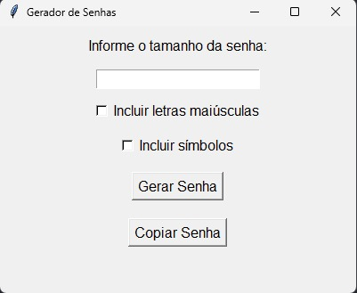

```markdown
# Gerador de Senhas Aleatórias

Este projeto é um gerador de senhas aleatórias desenvolvido em Python usando a biblioteca Tkinter para criar uma interface gráfica simples e funcional. O gerador permite que você crie senhas com diferentes tamanhos e características, como inclusão de letras maiúsculas e símbolos. 

## Funcionalidades

- **Entrada de Tamanho da Senha**: O usuário pode especificar o comprimento da senha desejada.
- **Inclusão de Letras Maiúsculas**: Opção para incluir letras maiúsculas na senha.
- **Inclusão de Símbolos**: Opção para incluir caracteres especiais (símbolos) na senha.
- **Geração de Senha**: Gera uma senha aleatória baseada nas opções selecionadas.
- **Copiar Senha**: Permite copiar a senha gerada para a área de transferência com um clique.

## Requisitos

- Python 3.x
- Tkinter (incluído com Python)

## Como Executar

1. Clone este repositório:
   ```sh
   git clone https://github.com/educomunaledev/gerador_senhas.git
   ```

2. Navegue até o diretório do projeto:
   ```sh
   cd gerador_senhas
   ```

3. Execute o script:
   ```sh
   python gerador_senha.py
   ```

## Imagens

Veja a interface gráfica do gerador de senhas:



## Código

O código-fonte está localizado no arquivo `gerador_senha.py`. As principais partes do código incluem:

- **Função `gerar_senha`**: Gera uma senha aleatória com base nas opções fornecidas.
- **Função `gerar_senha_evento`**: Responsável por gerar a senha e copiá-la para a área de transferência.
- **Função `copiar_senha_evento`**: Copia a senha gerada para a área de transferência e atualiza a interface gráfica.
- **Interface Gráfica**: Configuração da interface usando Tkinter, com campos para entrada de dados, botões e labels.

## Contribuições

Se você deseja contribuir para este projeto, sinta-se à vontade para enviar pull requests ou abrir issues para relatar bugs ou sugerir melhorias.

## Licença

Este projeto é licenciado sob a [MIT License](LICENSE).

```
