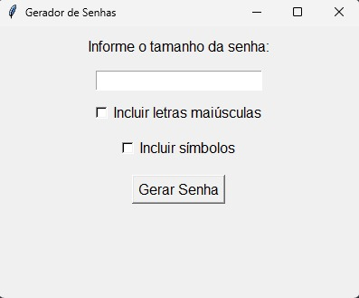

# Gerador de Senhas Aleatórias

Este projeto é um gerador de senhas aleatórias em Python. Ele permite criar senhas de comprimento personalizado, com opções para incluir letras maiúsculas e símbolos.

## Funcionalidades

- **Geração de Senhas Aleatórias**: O gerador cria senhas com base em um comprimento definido pelo usuário.
- **Opções de Personalização**:
  - Inclui letras maiúsculas
  - Inclui símbolos (como !, @, #, etc.)
- **Interface Gráfica**: Utiliza a biblioteca Tkinter para fornecer uma interface gráfica simples e intuitiva para o usuário.

## Como Usar

1. **Executar o Script**: Rode o script Python `gerador_senha.py` em seu ambiente Python.
2. **Definir o Comprimento da Senha**: Insira o comprimento desejado para a senha no campo fornecido.
3. **Escolher Opções de Personalização**:
   - Marque a opção para incluir letras maiúsculas, se desejado.
   - Marque a opção para incluir símbolos, se desejado.
4. **Gerar Senha**: Clique no botão "Gerar Senha" para visualizar a senha gerada.

## Exemplo de Interface



## Dependências

- Python 3.x
- Tkinter (geralmente incluído na instalação padrão do Python)

## Executando o Projeto

Para executar o projeto, você deve ter o Python instalado em seu sistema. Execute o script `gerador_senha.py` usando o comando:

```bash
python gerador_senha.py
```

## Contribuições

Sinta-se à vontade para contribuir com melhorias ou novos recursos. Se você encontrar um bug ou tiver uma sugestão, abra um [issue](https://github.com/educomunaledev/gerador_senhas/issues).

## Licença

Este projeto está licenciado sob a [MIT License](LICENSE).
